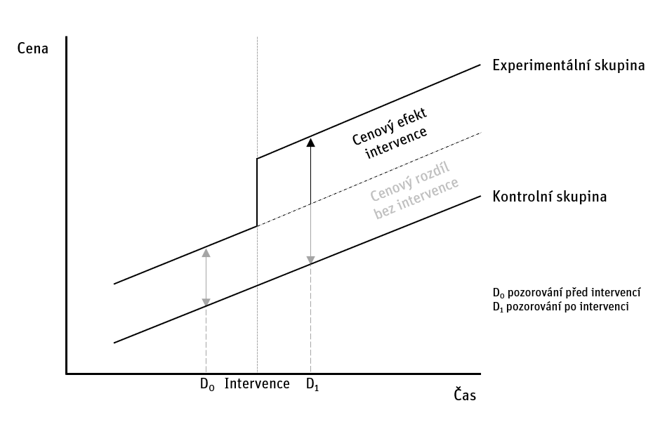

# Metoda DID: stručný úvod do teorie

Metody Diff-in-Diff se využívají na měření efektů intervencí, kdy je buď vytvořen nový veřejný statek nebo je stávající veřejný statek upraven. Proto jsou ceny nemovitostí v experimentální a kontrolní skupině porovnávané ve dvou časových bodech – těsně před intervencí a těsně po intervenci, viz. graf č.1 níže.

*Graf č.XXX. Odhad efektu intervence metodou Diff-in-Diff.*

Odhad kauzálního efektu metodou Diff-in-Diff je postaven na předpokladu, že obě srovnávané skupiny měly před intervencí shodný trend cen, a že tento trend by zůstal stejný i po intervenci v případě, že by daná intervence nebyla realizována. Pokud je předpoklad shodné trendu splněn, potom statisticky významná odchylka v cenách nemovitostí v experimentální a kontrolní skupině po intervenci prokazuje efekt intervence.
Formálně můžeme hedonickou cenu daného statku vyjádřit koeficientem β_1 v následující regresní funkci, kde p_i  je cena nemovitosti i, D binární proměnná příslušnosti do experimentální skupiny, T binární proměnná časového období po intervenci a ε_i odchylka modelované ceny od skutečné ceny nemovitosti.  
$p_i=β_0+ β_1 (T*D)+β_2 (T)+β_3 (D)+ ε_i$  
Regresní analýza poskytuje bodový odhad koeficientů funkce. 
Typickým příkladem intervence měřené metodou Diff-in-Diff je realizace nové stanice metra. Efekt nově realizované stanice metra lze odvodit porovnáním mezních cen nemovitostí v okolí nové stanice (experimentální skupina) po její realizaci s ostatními nemovitostmi (kontrolní skupina) (Hanck 2011) 
