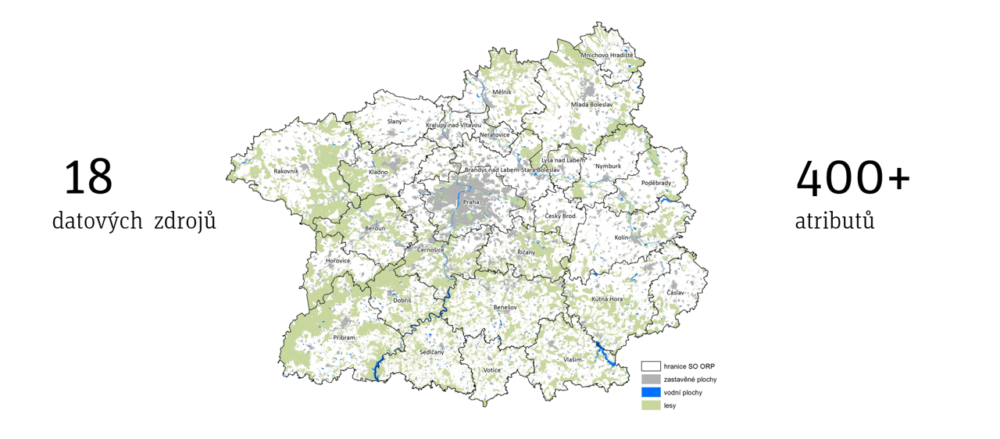

--- 
title: "Projekt VAL4PLAN"
author: "Aldin Kacarevic and the VAL4PLAN team"
date: "`r Sys.Date()`"
site: bookdown::bookdown_site
documentclass: book
bibliography: [book.bib, packages.bib]
# url: your book url like https://bookdown.org/yihui/bookdown
# cover-image: path to the social sharing image like images/cover.jpg
description: |
  This is a minimal example of using the bookdown package to write a book.
  The HTML output format for this example is bookdown::gitbook,
  set in the _output.yml file.
link-citations: yes
github-repo: rstudio/bookdown-demo
---
# O projektu 

## Proč VAL4PLAN?

dorem dorem ipsum ipsum
dorem dorem ipsum ipsum
dorem **dorem ipsum** ipsum
dorem dorem ipsum ipsum
dorem *dorem ipsum* ipsum
dorem dorem ipsum ipsum
dorem dorem ipsum ipsum


## Cíl projektu

Vytvořit praktické nástroje (valuační modely), které umožní a) z dat o cenách tržních statků (zde nemovitostí) případně z dalších dat, odhadnout užitnou hodnotu veřejných statků, zejména veřejné vybavenosti, veřejných prostranství a veřejné infrastruktury, které nejsou trhem přímo oceněné; b) odhadnout dopad připravovaných veřejných i soukromých záměrů na cenu residenčních, případně i komerčních nemovitostí. Dalším cílem projektu bude prověřit možná využití valuačních modelů v procesu územního plánování a územního rozhodování a ex-ante posuzování proveditelnosti rozvojových záměrů na území pražského metropolitního regionu, a také v odborném vzdělávání.


více se dozvíte [zde](https://starfos.tacr.cz/cs/project/TL03000695)


## Použitá data 



Použili jsme např.:

* data 1 ČSÚ
* data 2 Deloitte 
* data 3 XXX
* data 4 XXX
* data 5 XXX
* data 6 XXX


Preview book (pozůstatek)

As you work, you may start a local server to live preview this HTML book. This preview will update as you edit the book when you save individual .Rmd files. You can start the server in a work session by using the RStudio add-in "Preview book", or from the R console:


```{r eval=FALSE}
library(bookdown)
preview_chapter()
```

```{r eval=FALSE, message=FALSE}
library(bookdown)
serve_book(dir = ".", output_dir = "_book", preview = TRUE,
  in_session = TRUE, quiet = FALSE)
```

```{r include=FALSE}
# automatically create a bib database for R packages
knitr::write_bib(c(
  .packages(), 'bookdown', 'knitr', 'rmarkdown'
), 'packages.bib')
```


```{r eval=FALSE, message=FALSE, echo=FALSE}
#Tento kouse kodu je tu pro rendrovani knihy manualne (tj. kdyz nechceme klikat build book)
library(bookdown)
bookdown::render_book("index.Rmd", "bookdown::gitbook")
```


